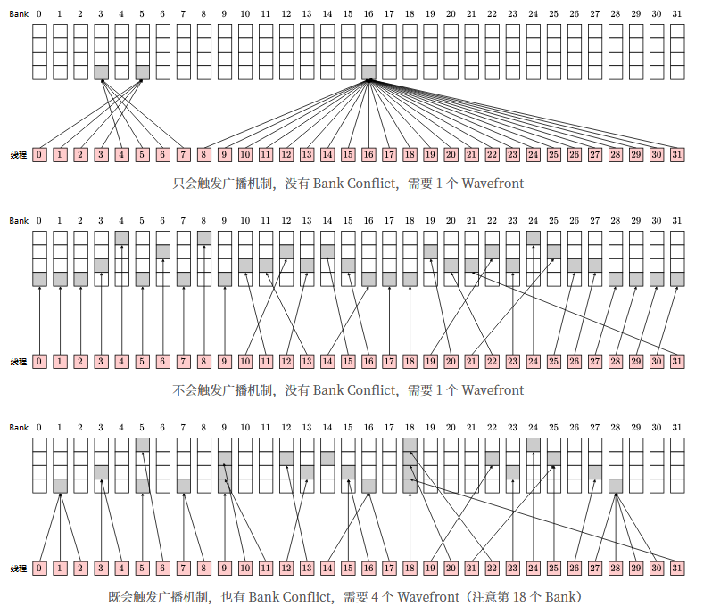
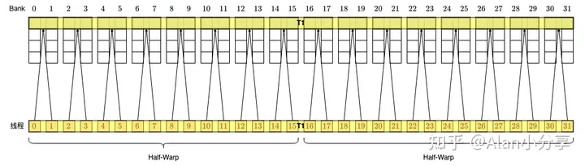
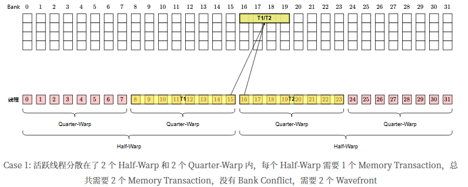
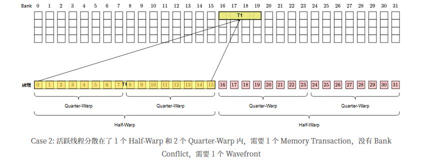
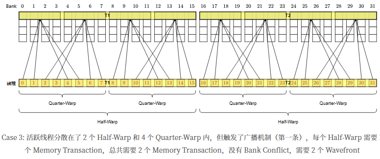
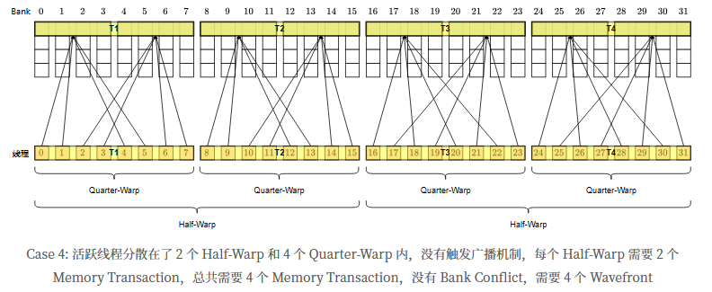
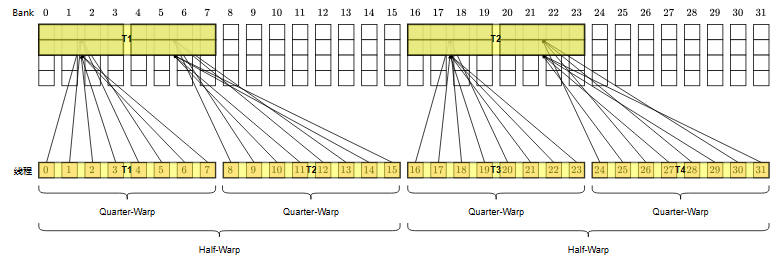

# Cuda 中的bank conflict 和 向量化访存

在做算子优化的过程中，我们经常需要充分运用shared memory中的broadcast机制以及避免bank conflict的出现。同时还会用到LDS.64 LDS.128指令等一次性访问8bytes和16bytes的数据。

但是问题在于：nvidia只公布每个thread访问4byte时的broadcast机制和bank conflict机制[nvidia broadcast and bank conflict](https://link.zhihu.com/?target=https%3A//docs.nvidia.com/cuda/cuda-c-programming-guide/index.html%3Fhighlight%3Dclock%23shared-memory-5-x)

但是，**对于使用 LDS.64 或 LDS.128 指令时的情况（即每个 thread 访问超过 4 个 bytes），却很难找到官方文档**。

## 简单情况
看看单次对于shared memory的数据请求，如果每个warp中的每个thread访问4字节的数据，则broadcast和bank conflict机制很简单：
* 当多个thread访问同一个bank内的同一个word，就会触发broadcast机制，这个word会同时发给对应的thread
* 当多个thread访问同一个bank内的不同的word，就会产生conflict。于是请求会被拆分成多次memory transaction，串行地被发射(issue)出去执行（比如2-way conflict就是指会被当做两次memory transaction发射）

     

总结：**单次请求中，warp 内 32 个 thread，每个访问 4 bytes，那么总的数据需求就是最多 128 bytes。只要不产生 bank conflict，一次 memory transaction 就够了。取回来 128 bytes 的数据，warp 内怎么分都可以**

## LDS.64
使用LDS.64指令取数据时，每个thread请求64bits，那么每16个thread就会取128bytes的数据。

**这个时候，CUDA会默认将一个warp拆分为两个half warp，每个half warp产生一次memory transaction，即一共两次transaction**

**当满足以下条件之一，CUDA会将这两次访问合并：**
* 对于 Warp 内所有活跃的第 i 号线程，第 i xor 1 号线程不活跃或者访存地址和其一致；(i.e. T0==T1, T2==T3, T4==T5, T6==T7, T8 == T9, ......, T30 == T31, etc.)
* 对于 Warp 内所有活跃的第 i 号线程，第 i xor 2 号线程不活跃或者访存地址和其一致；(i.e. T0==T2, T1==T3, T4==T6, T5==T7 etc.)

（活跃是指有访存需求）


### case 1
每个线程依次访问连续的 uint2。即第 tid 个线程，访问第 tid 个 uint2。

这时，并没有触发合并的条件，每个 half warp 分别执行一次 memory transaction，一共两次。也没有产生 bank conflict。

**其实 bank conflict 是针对单次 memory transaction 而言的。如果单次 memory transaction 需要访问的 128 bytes 中有多个 word 属于同一个 bank，就产生了 bank conflict，从而需要拆分为多次 transaction。**

比如这里，第一次访问了 0 - 31 个 word，第二次访问了 32 - 63 个 word，每次 transaction 内部并没有 bank conflict。

### case 2


这个模式就是符合了合并条件中的第一条,所以两个 half warp 的访问合并，一共只有 1 次 memory transaction，没有 bank conflict

## LDS.128
使用 LDS.128 指令（或者通过 float4、uint4 等类型）取数据时，每个 thread 请求 128 bits（即 16 bytes）数据，那么每 8 个 thread 就需要请求 128 bytes 的数据

，CUDA 会默认把每个 half warp 进一步切分成两个 quarter warp，每个包含 8 个 thread。每个 quarter warp 产生一次 memory transaction。所以每个 warp 每次请求，默认会有 4 次 memory transaction。（没有 bank conflict 的情况下）。

**当满足特定条件时，一个 half warp 内的两个 quarter warp 的访存请求会合并为 1 次 memory transaction。但是两个 half warp 不会再进一步合并了**

具体条件和 64 位宽一样：
* 对于 half Warp 内所有活跃的第 i 号线程，第 i xor 1 号线程不活跃或者访存地址和其一致；(i.e. T0==T1, T2==T3, T4==T5, T6==T7, T8 == T9, ......, T30 == T31, etc.)
* 对于 half Warp 内所有活跃的第 i 号线程，第 i xor 2 号线程不活跃或者访存地址和其一致；(i.e. T0==T2, T1==T3, T4==T6, T5==T7 etc.)

### case 1

### case 2


### case 3


### case 4



这个排布有点意思，第一个 half warp 满足合并条件 1，第二个half warp 满足合并条件 2。但是**需要整个 warp 都满足条件 1，或者条件2**，或者 1、2 同时满足，这样才可以合并。

### case 5


thread 0 - 3 访问第 0 个 uint4， thread 4 - 7 访问第 8 个 uint4（到了第二行）；

thread 8 - 11 访问第 1 个 uint4， thread 12 - 15 访问第 9 个 uint4（到了第二行）；

这里符合合并条件 1，所以前两个和后两个 quarter warp 分别合并。但是每个 half warp 内，产生了 2-way bank conflict，所以需要拆成 2 次 transaction。

即一共 2 个 bank conflict， 4 次 transaction。


## ncu 测试 bank conflict
```
ncu --metrics shared_op_ld exe_name
```

多个metrics：
```
ncu --metrics shared_op_ld,shared_op_st  bank_conflict_test
```
## reference
> https://code.hitori.moe/post/cuda-shared-memory-access-mechanism-with-vectorized-instructions/

> https://zhuanlan.zhihu.com/p/690052715

> https://github.com/NgCafai/gpu-programming-samples/tree/master/cuda_samples/concepts_and_techniques/shared_memory
