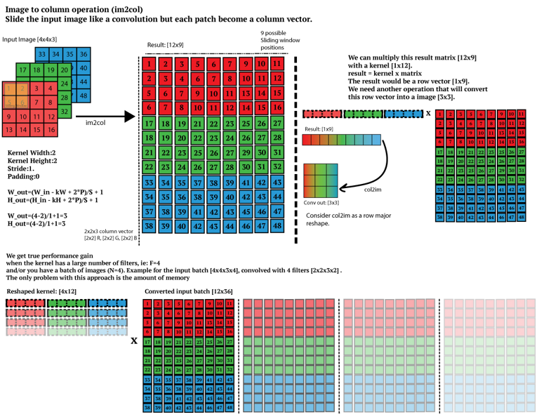

# Conv Optimization
## im2col

作用：将多次的gemm转化为一次gemm，减少调用gemm的次数  
假设现在有`2x2`的卷积核，`im2col`的思想为：  
**将`(2,2)*(2,2)`的矩阵乘积转化为(1,4)*(4,1)，这样在卷积核移动的时候，就构成了一个大矩阵**  
为了达成这个目的：**将卷积核按照行展开成(1,4)，将卷积核对应的image按照行展开成(4,1)，形成了列向量，也就是im2col的由来**   
[图源链接](https://leonardoaraujosantos.gitbook.io/artificial-inteligence/machine_learning/deep_learning/convolution_layer/making_faster)