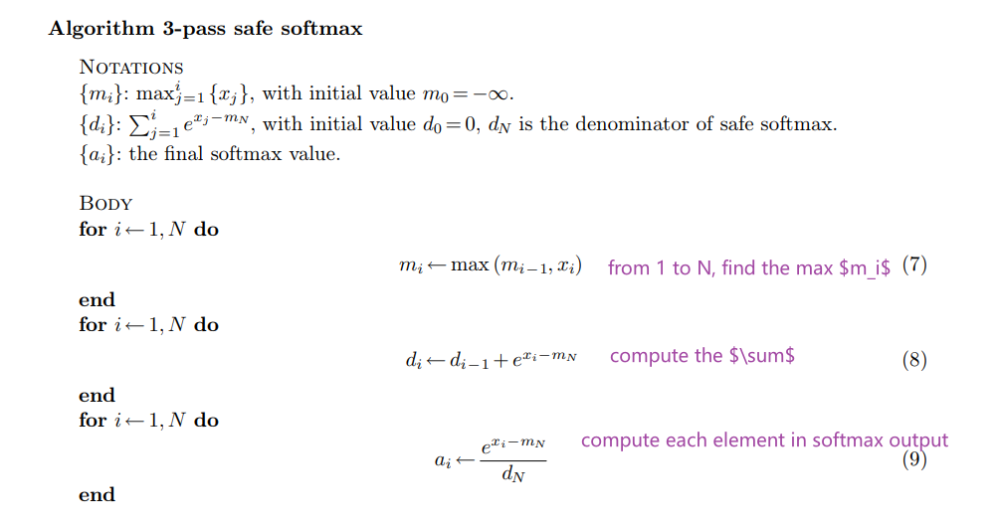
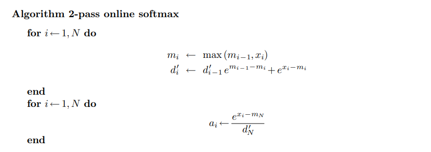
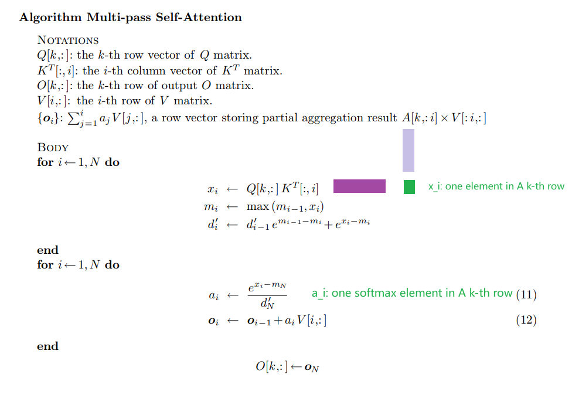
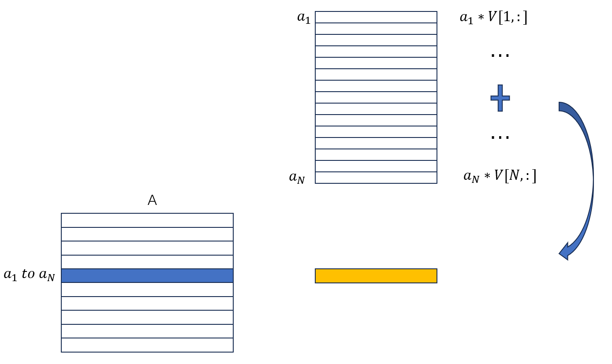
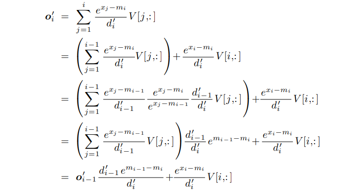
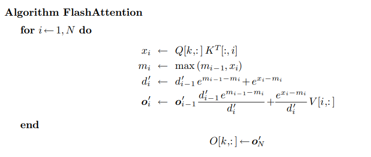
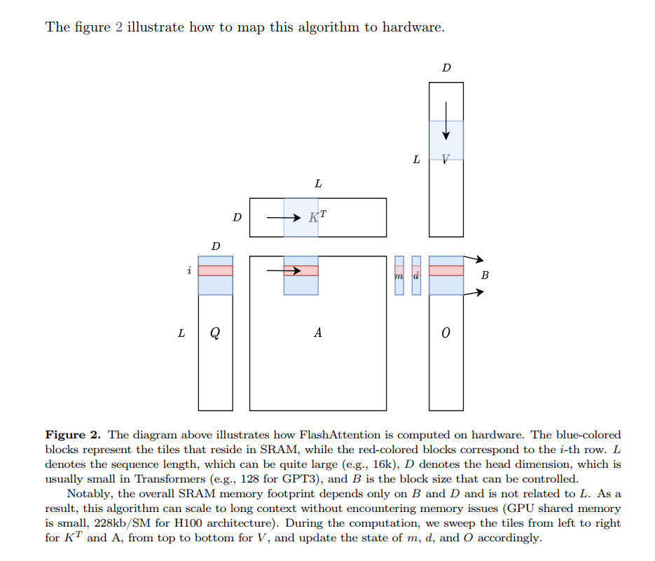

# FlashAttention
This is a minimal implementation of FlashAttention.

## Falsh Attention Overview
### Self-Attention
below is the computation pipeline of self-attention.
$$
X = QK^T\\
A = softmax(X)\\
O = AV
$$

### safe softmax
Let's recall the softmax operator first:
$$
softmax({x_1, x_2,...,x_N})=\{\frac{e^{x_i}}{\sum_{j=1}^{N}e^{x_j}}\}_{i=1}^{N}
$$

Note that $x_i$ might be very large and $e^{x_i}$ can easily overflow. Due to the numerical stability, we always compuate the `softmax` in a safe way:
$$
\frac{e^{x_i}}{\sum_{j=1}^{N}e^{x_j}}=\frac{e^{x_i-m}}{\sum_{j=1}^{N}e^{x_j-m}}
$$
where $m=max_{j=1}^{N}(x_j)$

### online softmax
if we fuse the eqution 7. 8. 9., then we can reduce the global memory access time from 3 to 1. **Unfortunately, we can not fuse the eqution 7 and 8, bacause 8 depands on the $m_N$**.

We can create another squence $d_i^{'}:=\sum_{j=1}^{i}e^{x_j-m_i}$ as a surrogate for original squence $d_i:=\sum_{j=1}^{i}e^{x_j-m_N}$ to remove the dependency on $m_N$. Besides, the N-th term of these two squences is identical:$d_N=d_N^{'}$. Thus we can safaly replace $d_N$ in eqution 9 with $d_N^{'}$. We can also find the recurrence relation between $d_i^{'}$ and $d_{i-1}^{'}$:
$$
\begin{align*}
d'_i &= \sum_{j=1}^i e^{x_j - m_i} \\
     &= \left( \sum_{j=1}^{i-1} e^{x_j - m_i} \right) + e^{x_i - m_i} \\
     &= \left( \sum_{j=1}^{i-1} e^{x_j - m_{i-1}} \right) e^{m_{i-1} - m_i} + e^{x_i - m_i} \\
     &= d'_{i-1} e^{m_{i-1} - m_i} + e^{x_i - m_i}
\end{align*}
$$

This recurrent form only depend on $m_i$ and $m_{i-1}$, and we can compute $m_j$ and $d'_j$ together in the same loop.

This is the algorithm proposed in Online Softmax paper [online softmax](https://arxiv.org/abs/1805.02867). However it still requires 2-pass, can we reduce the number of passes to 1-pass to minimize global I/O?

### Flash Attention
Unfortunately, the answer is NO! BUT in self-attention, our final goal is not the softmax matrix $A$, but the output $O$ which equals $A \times V$. Can we find a 1-pass recurrence form for $O$ instead?

Let's try to formulate the k-th row(one row for simplicity) of self-attention computation:

as for the last two equtions:

Let's replace the $a_i$ in eqution 12, we get
$$
o_i:=\sum_{j=1}^{i}(\frac{e^{x_j-m_N}}{d'_N}V[j,:])
$$

**This still depends on $m_N$ and $d_N$ which can not be determined until the previous loop ends.**

Like the surrogate trick in Online Softmax, we create a surrogate squence $o'$.
$$
0'_i:=(\sum_{j=1}^{i}\frac{e^{x_j-m_i}}{d'_i}V[j,:])
$$

The n-th element of $o$ and $o'$
are the identical: $o'_N=o_N$, and we can find a recurrence relation between $o'_N$ and $o_N$:

which only depends on $d'_i,d'_{i-1}, m_i, m_{i-1}, x_i$, thus we can fuse all computations in Self-Attention in a single loop

### Flash Attention in tile

## reference
1. [source code](https://github.com/luliyucoordinate/flash-attention-minimal?tab=readme-ov-file)

2. [From Online Softmax to FlashAttention](https://courses.cs.washington.edu/courses/cse599m/23sp/notes/flashattn.pdf)