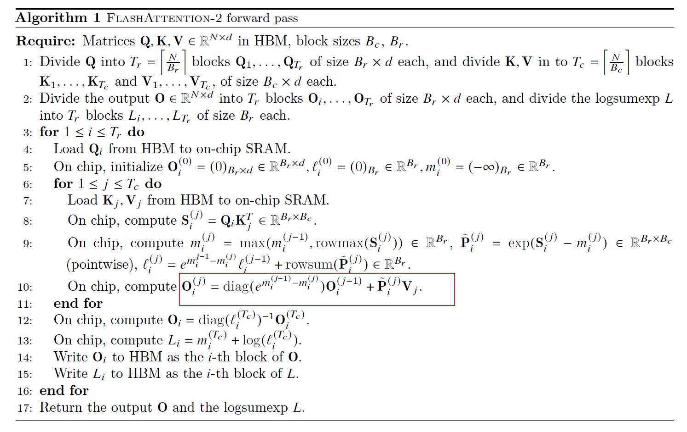

# FlashAttention
This is a minimal implementation of FlashAttention.

## Falsh Attention Overview
### Self-Attention
below is the computation pipeline of self-attention.
$$
X = QK^T\\
A = softmax(X)\\
O = AV
$$

### safe softmax
Let's recall the softmax operator first:
$$
softmax({x_1, x_2,...,x_N})=\{\frac{e^{x_i}}{\sum_{j=1}^{N}e^{x_j}}\}_{i=1}^{N}
$$

Note that $x_i$ might be very large and $e^{x_i}$ can easily overflow. Due to the numerical stability, we always compuate the `softmax` in a safe way:
$$
\frac{e^{x_i}}{\sum_{j=1}^{N}e^{x_j}}=\frac{e^{x_i-m}}{\sum_{j=1}^{N}e^{x_j-m}}
$$
where $m=max_{j=1}^{N}(x_j)$


### online softmax
if we fuse the eqution 7. 8. 9., then we can reduce the global memory access time from 3 to 1. **Unfortunately, we can not fuse the eqution 7 and 8, bacause 8 depands on the $m_N$**.

We can create another squence $d_i^{'}:=\sum_{j=1}^{i}e^{x_j-m_i}$ as a surrogate for original squence $d_i:=\sum_{j=1}^{i}e^{x_j-m_N}$ to remove the dependency on $m_N$. Besides, the N-th term of these two squences is identical:$d_N=d_N^{'}$. Thus we can safaly replace $d_N$ in eqution 9 with $d_N^{'}$. We can also find the recurrence relation between $d_i^{'}$ and $d_{i-1}^{'}$:
$$
\begin{align*}
d'_i &= \sum_{j=1}^i e^{x_j - m_i} \\
     &= \left( \sum_{j=1}^{i-1} e^{x_j - m_i} \right) + e^{x_i - m_i} \\
     &= \left( \sum_{j=1}^{i-1} e^{x_j - m_{i-1}} \right) e^{m_{i-1} - m_i} + e^{x_i - m_i} \\
     &= d'_{i-1} e^{m_{i-1} - m_i} + e^{x_i - m_i}
\end{align*}
$$

This recurrent form only depend on $m_i$ and $m_{i-1}$, and we can compute $m_j$ and $d'_j$ together in the same loop.


This is the algorithm proposed in Online Softmax paper [online softmax](https://arxiv.org/abs/1805.02867). However it still requires 2-pass, can we reduce the number of passes to 1-pass to minimize global I/O?

### Flash Attention

FA把优化目标是单个Head的Attention计算内，N是seqence length长度、d是hidden dimension大小。

如果没有softmax的话，我们可以把Q，K，V沿着N（seqence length维度）切成块，算完一块Q和一块K^T之后，立刻和一块V进行矩阵矩阵乘法运算（GEMM）。一方面，避免在HBM和SRAM中移动P矩阵了，另一方面，P矩阵也不需要被显式分配出来，消除了O(N^2) HBM存储的开销，从而达到了加速计算和节省显存的效果。

可是麻烦出现在Softmax！Softmax需要对完整的QK^T结果矩阵沿着Inner Loop维度进行归一化。Softmax需要全局的max和sum结果才能scale每一个元素，因此本地算出一块QK^T的结果还不能立刻和V进行运算，还要等同一行的后面的QK^T都算完才能开始，这就造成依赖关系，影响计算的并行。

Online softmax可以打破之前必须先算完一整行的QK^T结果，再和V相乘的依赖关系。算出local softmax结果立刻和V的分块运算，后面再通过乘系数矫正即可。

下面是FlashAttention的具体算法。


对于Algorithm中的Wirte to $O_i$，diag表示对角矩阵，例如以下：
```
1 0 0
0 2 0
0 0 3
```
它与一个`[3,3]`的矩阵相乘，相当于将另一个矩阵的行依次与`[1 2 3]`相乘。

对角矩阵的逆与另一个矩阵相乘，表示除。

### Flash Attention V2

我觉得V2最重要的提升点是参考Phil Tillet的Tirton版本，更改了Tiling循环的顺序。V1版本循环顺序是首先KV 作为outer迭代，Q作为inner迭代，在outer loop扫描时做softmax的规约，这导致outer loop必须在一个thread block里才能共享softmax计算中间结果的信息，从而只能对batch * head维度上以thread block为粒度并行切分。V2中调换了循环顺序，使outer loop每个迭代计算没有依赖，可以发送给不同的thread block并行执行，也就是可以对batch* head* sequence三层循环以thread block为粒度并行切分，从而显著增加GPU的吞吐。反向遵循同样的原理，不要把inner loop放在softmax规约的维度，因此正向反向的循环顺序是不同的。

**我的理解：在计算Self-Attention的时候，V1使用的方法是首先将K V当作outer迭代，而Q当作inner迭代。但是显然Q是独立的，可以被并行化的（例如，一个block解决一个Q中的一个小块，这样的话每个block之间是互不关联的，显然可以并行）。所以Flash Attention 2 中将Q当作了outer迭代，在Q的N维度上可以做到并行化**。

> 考虑一下，为什么K/V上的seq length方向不给到Thread Block做并行？答案是，如果可以在Q seq length上拆block并行了，那么一般来说GPU occupancy已经够了，再多拆K/V的话也不是不行，但是会额外带来通信开销；Flash Decoding其实就是在inference阶段，面对Q的seq length=1的情况，在K/V方向做了block并行，来提高GPU Utilization从而加速的。

现在确定了fwd kernel要在B, H, Q_N_CTX(就是从Q的N维度切分出来的，增加并行性)三个维度Launch Kernel了，有两种选择：grid_dim = [Q_N_CTX, B, H], grid_dim = [B, H, Q_N_CTX]，哪种更好？

答案是第一种更好，因为Q_N_CTX放ThreadBlock.X维度的话，对于同一个B和H的Q_N_CTX是连续调度的，也就是说算第一行用到的K/V Tile大概率还在L2上，第二行计算可以直接从L2拿到，这样可以显著提高L2 cache hit rate。这个优化在大seq_length的时候优化很明显。原理就是Thread Block的调度是round-robin的，对于[Q_N_CTX, B, H] 就是先遍历Q_N_CTX，然后遍历B，H；先遍历Q_N_CTX意味着同时会有很多个Block在计算同一个[B,H]的不同Q_N_CTX对应的Tile，那么对于同一列方向的QK输出Tile来说，K和V的Tile就可以在L2上复用；
简单来说就是Q_N_CTX维度局部性更好，BH维度是天然并行的维度，对于GEMM来说没啥局部性。

除了Sequence length维度的并行之外，Flash Attention V2的改动第二点在于算法的改变，fwd和bwd都简化了非matmul计算，这里也是对rescale重新优化了一下。这个优化其实不是critical path，所以提升并不大。fwd做2个GEMM，bwd做5个GEMM，整个Kernel fwd & bwd都是memory bound，此时应该优化的是GEMM相关的memory dependency，做multi-stages，更灵活的异步调度（比如warp specialization），最后可能还需要考虑优化data reuse，优化L2 cache等等，当然一切都需要基于Nsight Compute结果分析，不然都是幻觉。




## reference
1. [source code](https://github.com/luliyucoordinate/flash-attention-minimal?tab=readme-ov-file)

2. [From Online Softmax to FlashAttention](https://courses.cs.washington.edu/courses/cse599m/23sp/notes/flashattn.pdf)

3. [FlashAttention2详解](https://zhuanlan.zhihu.com/p/645376942)

4. [FlashAttention核心逻辑以及V1 V2差异总结(great!!!)](https://zhuanlan.zhihu.com/p/665170554)

5. [大模型训练加速之FlashAttention系列：爆款工作背后的产品观](https://zhuanlan.zhihu.com/p/664061672)