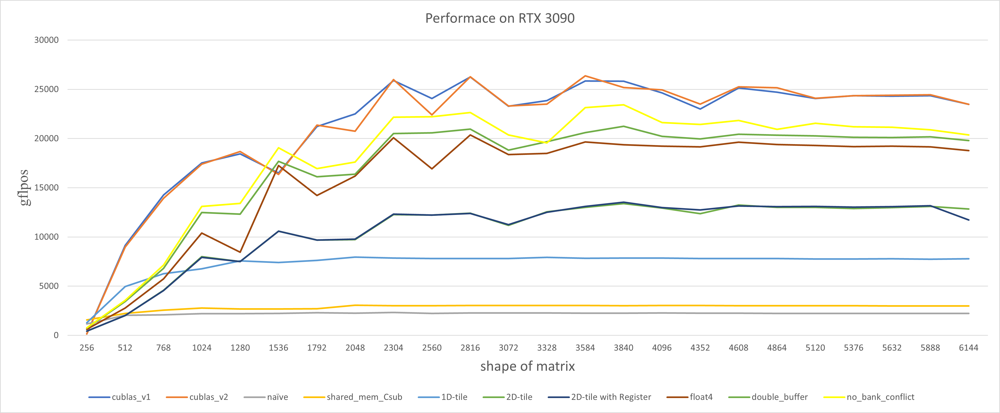
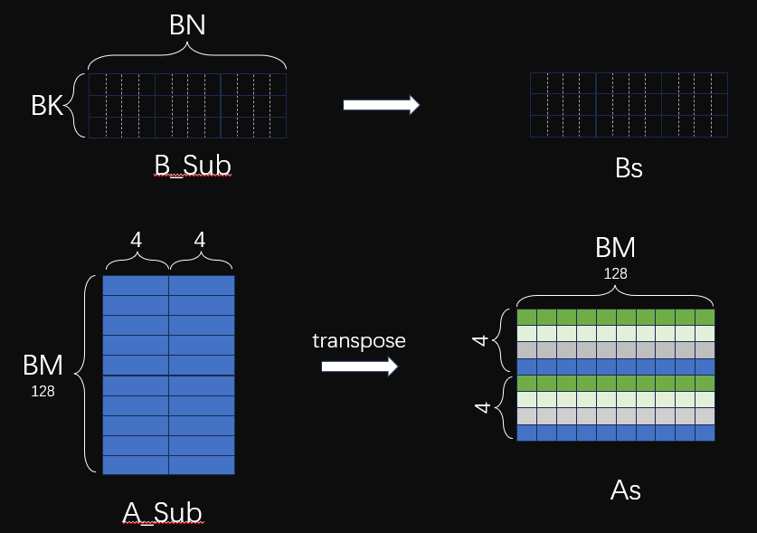

# SGEMM Optimization
这是我的SGEMM性能优化之路，其中包括的文件有：
* `gemm_2.cu`：naive gemm
* `gemm_3.cu`：using shared memory
* `gemm_4_X.cu`：tile, include 1D-tile 2D-tile and 2D-tile-with-register 
* `gemm_5.cu`：using float4
* `gemm_6_double_buffer`: using double buffer
* `gemm7_no_bank_conflict`: avoid bank conflict
* `z_lishaoxia_gemm.cu`: using [z order](https://zhuanlan.zhihu.com/p/441146275) to avoid bank conflict

## GTX3090 数据
1. [TechPowerUp](https://www.techpowerup.com/gpu-specs/geforce-rtx-3090.c3622)
2. [请问，如何查看GPU的计算能力？ - ZOMI酱的回答](https://www.zhihu.com/question/274259873/answer/2982008684)
3. [高性能计算入门](https://blog.csdn.net/zhazhiqiang/article/details/82179890)
4. [Nvidia各个compute capability下的技术细节](https://docs.nvidia.com/cuda/cuda-c-programming-guide/index.html#features-and-technical-specifications-technical-specifications-per-compute-capability)

通过`/usr/local/cuda/extras/demo_suite/device_query`查询，结果如下：

```cpp
Device 0: "NVIDIA GeForce RTX 3090"
CUDA Driver Version / Runtime Version          12.2 / 12.1
CUDA Capability Major/Minor version number:    8.6
Total amount of global memory:                 24238 MBytes (25414860800 bytes)
(82) Multiprocessors, (128) CUDA Cores/MP:     10496 CUDA Cores
GPU Max Clock rate:                            1740 MHz (1.74 GHz)
Memory Clock rate:                             9751 Mhz
Memory Bus Width:                              384-bit
L2 Cache Size:                                 6291456 bytes(6 MB)
// Maximum Texture Dimension Size (x,y,z)         1D=(131072), 2D=(131072, 65536), 3D=(16384, 16384, 16384)
// Maximum Layered 1D Texture Size, (num) layers  1D=(32768), 2048 layers
// Maximum Layered 2D Texture Size, (num) layers  2D=(32768, 32768), 2048 layers
// Total amount of constant memory:               65536 bytes
Total amount of shared memory per block:       49152 bytes(48KB)
Total number of registers available per block: 65536
Warp size:                                     32
Maximum number of threads per multiprocessor:  1536
Maximum number of threads per block:           1024
Max dimension size of a thread block (x,y,z): (1024, 1024, 64)
Max dimension size of a grid size    (x,y,z): (2147483647, 65535, 65535)
// Maximum memory pitch:                          2147483647 bytes
// Texture alignment:                             512 bytes
// Concurrent copy and kernel execution:          Yes with 2 copy engine(s)
// Run time limit on kernels:                     Yes
// Integrated GPU sharing Host Memory:            No
// Support host page-locked memory mapping:       Yes
// Alignment requirement for Surfaces:            Yes
// Device has ECC support:                        Disabled
// Device supports Unified Addressing (UVA):      Yes
// Device supports Compute Preemption:            Yes
// Supports Cooperative Kernel Launch:            Yes
// Supports MultiDevice Co-op Kernel Launch:      Yes
// Device PCI Domain ID / Bus ID / location ID:   0 / 4 / 0
// Compute Mode:
//     < Default (multiple host threads can use ::cudaSetDevice() with device simultaneously) >

// deviceQuery, CUDA Driver = CUDART, CUDA Driver Version = 12.2, CUDA Runtime Version = 12.1, NumDevs = 1, Device0 = NVIDIA GeForce RTX 3090
// Result = PASS
```

我们所说的 CUDA Core 数量，通常对应的是 FP32 计算单元的数量。每个时钟周期内，一个CUDA核心通常能够执行以下操作之一：
1. 浮点加法
2. 浮点乘法
3. 浮点乘加（FMA），这也是一个重要的操作，结合了乘法和加法，能够在一个时钟周期内完成。

**另外的重要信息**如下：
* clock：高主频意味着处理器在每秒钟可以执行更多的时钟周期，从而能够处理更多的指令。基础clock为1395 MHz，超频可以达到1695 MHz.
* 第三代Tensor Core，每个SM共有4个TensorCore
* 算力：GPU 算力跟计算核心个数、核心频率、核心单时钟周期能力三个因素有关。计算公式如下
    $$
    PeakFlops=F_{clk}*N_{SM}*F_{req}
    $$
    其中 `F_clk` 为 GPU 的时钟周期内指令执行数 (单位为 `FLOPS/Cycle`)， `F_req` 为运行频率 (单位为 `GHz`)， `N_SM` 为 GPU SM 数量 (单位为 `Cores`)。以3090白皮书为例，其SM中cuda core为128，总共有82个SM，boost clock为1695 MHz，所以：
    $$
    1.695 * 128 * 82 * 2 = 35,581 GFLPOS = 3.6 TFLOPS
    $$
    与白皮书中一致，具体可见白皮书GA-102中的Table.9。
* 存储带宽：936GB/sec

## 性能对比


## 技术细节

### naive gemm
这是最简单的gemm测试，不考虑使用shared memory

每个线程负责计算C中的一个元素，所以每个线程计算元素需要for循环K个元素，从全局内存中读取2*K次，并写入全局内存1次

**一个发现**：在计算C矩阵的时候，C(x,y)维度和由线程对应的index(x,y)的对应关系对性能有很大影响。代码如下：
```cpp
int x = block_size * blockIdx.x + threadIdx.x;
int y = block_size * blockIdx.y + threadIdx.y;

if (y < m && x < n) {
    float sum = 0.0;
    for (int i = 0; i < k; i++) {
        sum += a[y * lda + i] * b[i * ldb + x];
    }
    c[y * ldc + x] = sum;
}

/*
if we exchange x and y, we will get a bad performance

if (x < m && y < n) {
    float sum = 0.0;
    for (int i = 0; i < k; i++) {
        sum += a[x * lda + i] * b[i * ldb + y];
    }
    c[x * ldc + y] = sum;
}
*/
```
这是由于每个线程计算矩阵C中的一个元素，需要A中的一行乘以B中的一列。由于A和B都是行优先存储的，所以线程中B的一列必然不可能是连续读取。如果采用调换`x,y`即代码中`a[x * lda + i]`，那么相邻的两个线程例如0和1，他们分别访问的是`a[0]`和`a[lda]`，此时a矩阵的访问也是非合并访问了，降低了内存的吞吐量。

**L1和L2 cache**：L2 cache是所有的SM共享的，而L1 cache是单个SM内部的。

**合并访问和非合并访问**：由于核函数执行过程中，每个时刻只有一个warp在SM上执行，所以在一个warp内，需要内存访问是合并（即一个warp内的线程读取的global memory是连续的）。

### using shared memory
当然，这个时候就会想要用到shared memory，因为计算C中的一个元素，从全局内存中读取2*K次，这太傻了...从全局内存读取大概需要200-300cycle，这限制了核函数的计算效率，大量的时间花费在了等待数据的访问上，因此可以使用shared memory来缓存数据。

shared memory是block块内线程共享的，对于一个block中需要计算的BM * BN元素，**有许多重复的地址访问**。因此我们可以使用共享内存缓存一个block中所需要的元素，缓存完毕之后，计算时直接从共享内存中读取数据，节约等待访存时间。**还是一个线程计算一个C中的元素**，如下图所示：


对于BK，我们当然希望BK=K，那么一次性就能全部缓存一个block计算所需要的A和B中的数据，但是当矩阵过大时候，shared memory资源限制不允许我们一次性缓存K长度的数据，因此我们将K长度的数据进一步地划分为BK大小，每次都是缓存BK大小的数据。所以计算流程为：**缓存BK大小的数据-->计算-->缓存下一步的BK大小的数据-->计算--> .... --> 直至K大小的数据计算完毕**。

```cpp
template <int BLOCK>
__global__ void sgemm(int m, int n, int k, float *a, float *b, float *c)
{
    int tx = threadIdx.x;
    int ty = threadIdx.y;
    int bx = blockIdx.x;
    int by = blockIdx.y;

    float *begin_a = a + bx * BLOCK * k;
    float *begin_b = b + by * BLOCK;
    float *end_a = begin_a + k;

    float sum = 0.f;

    cg::thread_block cta = cg::this_thread_block();

    // init the shared memory
    __shared__ float a_smem[BLOCK][BLOCK];
    __shared__ float b_smem[BLOCK][BLOCK];

    for(float *a_ptr = begin_a, *b_ptr = begin_b; a_ptr < end_a;
        a_ptr += BLOCK, b_ptr += BLOCK * n) {
        
        // note: exchange tx and ty cause the performance decline by half
        a_smem[ty][tx] = a_ptr[ty * k + tx];
        b_smem[ty][tx] = b_ptr[ty * n + tx];
        __syncthreads();

#pragma unroll  // has little impact
        for (int i = 0; i < BLOCK; i++) {
            sum += a_smem[ty][i] * b_smem[i][tx];
        }
        __syncthreads();
    }

    c[(BLOCK * bx + ty) * n + BLOCK * by + tx] = sum;
}
```

### 1D-tile

上一个版本中，将global memory中的数据加载到shared memory中，让访存的代价从几百个cycle降低到几十个cycle。但是这并不改变本质问题，一次乘累加只需要几个cycle。**问题的关键在于核心代码的循环计算部分，计算访存比过低，最终导致访存延迟不能被隐藏，从而性能不理想**。

我们无论是使用全局内存还是共享内存，主要的瓶颈都在访存上。为了进一步掩盖访存开销，我们要么可以提高访存的效率，要么让每个线程的负载更多一点，以使得能够掩盖访存的开销。

这里我们先尝试提高每个线程的负载， 让每个线程多计算一些元素的输出。**1d-tile的意思是选择BM或者BN其中一个维度（这里是BM），让每个thread计算这个维度TM大小的数据**。


由于一个block中的thread需要计算TM个数据，因此每个线程在从Global Memory中缓存数据到Shared Memory中的时候，也是需要缓存TM个数据的。
```cpp
template <const int BM, const int BN, const int BK, const int TM>
__global__ void tile_1d_kernel(int M, int N, int K, float alpha, float *A, float *B, float beta, float *C) {
    
    __shared__ float As[BM][BK];
    __shared__ float Bs[BK][BN];
    float val[TM] = {0.};
    int num_shared_block = CEIL_DIV(K, BK); // or CEIL_DIV(K, BN);
    // 而&运算符被用来获取该区域的地址
    A = &A[OFFSET(blockIdx.y * BM, 0, K)];
    B = &B[OFFSET(0, blockIdx.x * BN, N)];
    C = &C[OFFSET(blockIdx.y * BM, blockIdx.x * BN, N)];

    for (int i = 0; i < num_shared_block; ++i) {
        // Copy data from global memory to shared memory
        for (int m = 0; m < TM; ++m) {
            int A_row = threadIdx.y * TM + m;
            int A_col = threadIdx.x;
            if ((blockIdx.y * BM + A_row) < M && (i * BK + A_col) < K) {
                As[A_row][A_col] = A[OFFSET(A_row, A_col, K)];
            } else {
                As[A_row][A_col] = 0.;
            }
        }
        int B_row = threadIdx.y;
        int B_col = threadIdx.x;
        if ((i * BK + B_row) < K && (blockIdx.x * BN + B_col) < N) {
            Bs[B_row][B_col] = B[OFFSET(B_row, B_col, N)];
        } else {
            Bs[B_row][B_col] = 0.;
        }
        __syncthreads();
        A += BK;
        B += BK * N;
        for (int k = 0; k < BK; ++k) {
            for (int m = 0; m < TM; ++m) { 
                int A_row = threadIdx.y * TM + m;
                int B_col = threadIdx.x;
                val[m] += As[A_row][k] * Bs[k][B_col];
            }
        }
        __syncthreads();
    }

    for (int m = 0; m < TM; ++m) {
        int C_row = threadIdx.y * TM + m;
        int C_col = threadIdx.x;
        if ((blockIdx.y * BM + C_row) < M && (blockIdx.x * BN + C_col) < N) {
            C[OFFSET(C_row, C_col, N)] = alpha * val[m] + beta * C[OFFSET(C_row, C_col, N)];
        }
    }
}
```

### 2D-tile
进一步地，我们也可以在BN的维度进行tile，这样的话，**每个thread就计算[TM, TN]大小的数据**，如下图所示：


值得注意地是，按照 M-N-K 的循环嵌套顺序实际上是矩阵乘法的向量内积表示形式，A_tile 读取的位置与 i, p 有关，B_tile 读取的位置与 j, p 有关，循环嵌套之下产生了重复的 smem 读取。向量外积这种实现在最外层的一次循环中只需要加载一次矩阵 A 的列和矩阵B的行，然后进行外层乘法计算并把结果累加到矩阵C中，在此之后矩阵A的这一列和矩阵B的这一行就再也不会用到了。


向量外积的实现方法如图所示，即将 A 矩阵拆分为多个列向量、B 矩阵拆分为多个行向量，这些向量通过向量外积的方法求得最终答案。最外层的`K`迭代中，每一次都会更新整个`C`矩阵的值：分别用上图中`A`中的一列中的每个数据，乘`B`中的一行的所有值，每个数据的结果作为`C`矩阵的对应`A`中该数据的行。代码如下：

```cpp
for k in range(K):
    for i in range(M):
        for j in range(N):
            c[i,j]+=a[i,k]*b[k,j];
```
**在计算Sub_C中的每一块的时候，每次都是使用向量外积的方式计算。使用向量外积的方案可以利用到循环遍历的局部性，将一些重复访存使用寄存器缓存而避免无意义访存**。
```cpp
template <const int BM, const int BN, const int BK, const int TM, const int TN>
__global__ void tile_2d_kernel(int M, int N, int K, float alpha, float *A, float *B, float beta, float *C) {
    
    __shared__ float As[BM][BK];
    __shared__ float Bs[BK][BN];
    float val[TM][TN] = {0.f};

    int num_shared_block = CEIL_DIV(K, BK); // or CEIL_DIV(K, BN);
    A = &A[OFFSET(blockIdx.y * BM, 0, K)];
    B = &B[OFFSET(0, blockIdx.x * BN, N)];
    C = &C[OFFSET(blockIdx.y * BM, blockIdx.x * BN, N)];

    for (int i = 0; i < num_shared_block; ++i) {
        for (int m = 0; m < TM; ++m) {
            // A_row A_col 是相对于当前A的
            int A_row = threadIdx.y * TM + m;
            int A_col = threadIdx.x;
            // 需要计算全局范围（C矩阵的范围内）是否越界
            if ((blockIdx.y * BM + A_row) < M && (i * BK + A_col) < K) {
                As[A_row][A_col] = A[OFFSET(A_row, A_col, K)];
            } else {
                As[A_row][A_col] = 0.f;
            }
        }

        for (int n = 0; n < TN; ++n) {
            int B_row = threadIdx.y;
            int B_col = threadIdx.x * TN + n;
            
            if ((blockIdx.x * BN + B_col) < K && (i * BK + B_row) < N) {
                Bs[B_row][B_col] = B[OFFSET(B_row, B_col, N)];
            }
            else {
                Bs[B_row][B_col] = 0.f;
            }
        }
        
        __syncthreads();

        A += BK;
        B += BK * N;

        // for k 拿到里面性能下降严重
        for (int k = 0; k < BK; ++k) {
            for (int m = 0; m < TM; ++m) {
                int A_row = threadIdx.y * TM + m;
                for (int n = 0; n < TN; ++n) {
                    int B_col = threadIdx.x * TN + n;
                    val[m][n] += As[A_row][k] * Bs[k][B_col];
                }
            }
        }
        __syncthreads();
    }

    for (int m = 0; m < TM; ++m) {
        int C_row = threadIdx.y * TM + m;
        for (int n = 0; n < TN; ++n) {
            int C_col = threadIdx.x * TN + n;
            if ((blockIdx.y * BM + C_row) < M && (blockIdx.x * BN + C_col) < N) {
                C[OFFSET(C_row, C_col, N)] = alpha * val[m][n] + beta * C[OFFSET(C_row, C_col, N)];
            }
        }
    }
}
```

### 2D-tile register
2D-tile中，我们使用了向量外积，K循环在外面，TM和TN循环在内部，代码如下：
```
for (int k = 0; k < BK; ++k) {  // 向量外积
    for (int m = 0; m < TM; ++m) {
        int A_row = threadIdx.y * TM + m;
        for (int n = 0; n < TN; ++n) {
            int B_col = threadIdx.x * TN + n;
            val[m][n] += As[A_row][k] * Bs[k][B_col];
        }
    }
}
```

我们可以发现，在TM维度的循环中，其实之后计算所需要的As数据就已经确定了，也就是说无论下面的TN维度的循环，As中的数据都是一样的，那么我们就可以在TM中的循环中缓存这一部分的数据。

对于Bs中的内容，其也只取决于BK维度的循环和TN循环本身，对于TM维度，无论怎么变化，访问的也都是一样的，因此也可以进行缓存！

### float4
通过ncu的分析结果，可以看到当前很多的时间还是花在了访存等待上，可以看到内存带宽的使用负载大于计算负载。

因此除了上述提高计算强度，我们还可以通过`float4`提高访存的效率。相比于访存 4 次获取 4 个浮点数，通过 float4 向量内存指令所需的访存指令数更少，减少了对内存访问的竞争；另一方面，使用向量加载每个字节需要的索引计算更少，我们只需要计算一次索引即可读取 4 个浮点数



```cpp
#define FETCH_FLOAT4(pointer) (reinterpret_cast<float4*>(&(pointer))[0])

template <const int BM, const int BN, const int BK, const int TM, const int TN>
__global__ void tile_2d_kernel(int M, int N, int K, float alpha, float *A, float *B, float beta, float *C) {
    
    // 16 16
    const int block_row_thread = BN / TN;
    const int block_col_thread = BM / TM;
    // 256
    const int thread_num = block_row_thread * block_col_thread;
    int num_shared_block = CEIL_DIV(K, BK);

    __shared__ float As[BK][BM];    // transpose shared A for avoid bank conflict
    __shared__ float Bs[BK][BN];

    float accum[TM][TN] = {0.};

    // 1 1
    // 这里刚好一个block里面的线程 每个线程执行一次float4指令 就可以加载完As Bs
    // 不然的话 还需要多次加载 这里的time指的就是需要加载几次
    const int load_a_cache_time = (BK * BM) / (thread_num * 4);  // Each thread load 4 float
    const int load_b_cache_time = (BK * BN) / (thread_num * 4);  // Each thread load 4 float

    A = &A[OFFSET(blockIdx.y * BM, 0, K)];
    B = &B[OFFSET(0, blockIdx.x * BN, N)];
    C = &C[OFFSET(blockIdx.y * BM, blockIdx.x * BN, N)];

    // thread id: [0,thread_num(256))
    int thread_id = threadIdx.y * blockDim.x + threadIdx.x;
    // 当前线程负责的As中的行和列（相对于A来说的）
    int a_tile_row = thread_id / (BK / 4);
    int a_tile_col = thread_id % (BK / 4) * 4;
    // 多次加载的时候移动的offset
    // 为每次读取单独开辟了空间存储，而不是复用之前的空间。
    // 如果复用之前的空间，会因为数据写入地址的依赖导致计算结果出错
    int a_tile_stride = BM / load_a_cache_time;

    int b_tile_row = thread_id / (BN / 4);
    int b_tile_col = thread_id % (BN / 4) * 4;
    int b_tile_stride = BK / load_b_cache_time;

    float As_cache[TM] = {0.};
    float Bs_cache[TN] = {0.};

    float4 tmp;

    #pragma unroll
    for (int i = 0; i < num_shared_block; ++i) {
        #pragma unroll
        for (int m = 0; m < BM; m += a_tile_stride) {
            // 为什么As需要transpose？ 原因不在于store阶段，而在于load也就是计算阶段
            // 在从global加载到sharedMem时候，As中行列对换就可以了
            tmp = FETCH_FLOAT4(A[OFFSET(a_tile_row + m, a_tile_col, K)]);
            As[a_tile_col][a_tile_row + m] = tmp.x;
            As[a_tile_col + 1][a_tile_row + m] = tmp.y;
            As[a_tile_col + 2][a_tile_row + m] = tmp.z;
            As[a_tile_col + 3][a_tile_row + m] = tmp.w;
        }
        #pragma unroll
        for (int k = 0; k < BK; k += b_tile_stride) {
            FETCH_FLOAT4(Bs[b_tile_row + k][b_tile_col]) =
                    FETCH_FLOAT4(B[OFFSET(b_tile_row + k, b_tile_col, N)]);
        }
        __syncthreads();
        A += BK;        // Start position of next tile block to be processed
        B += BK * N;    // Start position of next tile block to be processed

        #pragma unroll
        for (int k = 0; k < BK; ++k) {
            #pragma unroll
            for (int m = 0; m < TM; m += 4) {
                int A_row = threadIdx.y * TM + m;
                // 在计算index的时候，计算下标的时候还是常规的计算取到的As的行列
                // 在真正的从As中取数据的时候，对换行列即可
                FETCH_FLOAT4(As_cache[m]) = FETCH_FLOAT4(As[k][A_row]);
            }
            #pragma unroll
            for (int n = 0; n < TN; n += 4) {
                int B_col = threadIdx.x * TN + n;
                FETCH_FLOAT4(Bs_cache[n]) = FETCH_FLOAT4(Bs[k][B_col]);
            }
            #pragma unroll
            for (int m = 0; m < TM; ++m) {
                #pragma unroll
                for (int n = 0; n < TN; ++n) {
                    accum[m][n] += As_cache[m] * Bs_cache[n];
                }
            }
        }
        __syncthreads();
    }

    #pragma unroll
    for (int m = 0; m < TM; ++m) {
        int C_row = threadIdx.y * TM + m;
        #pragma unroll
        for (int n = 0; n < TN; n += 4) {
            int C_col = threadIdx.x * TN + n;
            tmp = FETCH_FLOAT4(C[OFFSET(C_row, C_col, N)]);
            tmp.x = alpha * accum[m][n] + beta * tmp.x;
            tmp.y = alpha * accum[m][n + 1] + beta * tmp.y;
            tmp.z = alpha * accum[m][n + 2] + beta * tmp.z;
            tmp.w = alpha * accum[m][n + 3] + beta * tmp.w;
            FETCH_FLOAT4(C[OFFSET(C_row, C_col, N)]) = FETCH_FLOAT4(tmp);
        }
    }
}
```

**为什么需要transpose As**？因为后续的计算过程中读取As中的大小为TM的一列，如果不Transpose，那么无法通过`float4`读取。

**Transpose之后就不能实现float4 store了，就像上图一样，按照As中的float一个个store**。只不过store的时候一个thread 负责 4大小的一列，tid为0的thread负责As中的第一列，tid为1的thread负责tid为0的下面一列。**由于warp内天然同步，所以图中用四个颜色标识出来了(应该是一个warp内标识的，图中As全部标识了，是错误的)**

需要注意，因为使用了 FLOAT4 访存的缘故，矩阵的元素数量必须是 4 的倍数，不再能够支持任意大小的矩阵（实际上，还是可以支持的，但是边界条件需要更加细致的判断，对性能有所影响）

### double buffer
之前，我们只有一个As，那么在每次迭代(As Bs移动)的过程中，为了保证当前的线程已经完成了当前As和Bs的计算（从而才能第二次迭代的As和Bs的写数据）
我们使用了第二个__sync，保证 Write-After-Read

它本质上是因为我们在不同迭代中使用了同一块空间来保存我们所需的数据，这两次迭代中的数据之间并不存在真正的依赖关系

如果我们将其写入到其他地址上，那么就不需要使用同步了。**于是就可以利用并行化，将两次迭代的计算过程并行化，从而提高性能**。

因此，我们开辟了两倍的As和Bs的空间，如果当前使用的是As1和Bs1，那么下次迭代就使用As2 Bs2，从而使得两次迭代之间不存在依赖关系，从而避免第二次同步操作。


### 消除 bank conflict

#### store时bank conflict分析
##### As中
`float4`中的store shared memory 的 情况如下图所示：


可以看到在Store As的时候，线程奇数和偶数的线程会产生bank conflict，**本质上这是由于BK=8，BM=128（32的倍数），所以相邻的两个线程写入的是同一个bank**。

**解决办法**：将BM + 4，作为新的BM，这样的话相邻的两个线程写入的bank 偏移就是4 * 4(* 4 是因为图中颜色一样的差了4行)。同一个warp内访问的bank index 就是：0-16-1-17-...-15-31，从而解决了bank conflict的问题。

##### Bs
warp中32x4=128，所以一个warp内的线程刚好负责一个B_Sub中的一行。由于使用的是`LDS.128`指令，一个quarter warp=8内，8x4=32刚好访问的是所有bank 所以 **Bs中store是没有bank conflict，只不过是4次wavefont**。

#### load时z-order分析
z-order中的线程排布如下图所示：


As和Bs中的bank情况如下图：


图中的上半部分是Bs中的情况，下半部分是As中的情况，由于一个thread负责的是8*8大小，所以即使是`float4`指令，Bs和As也需要两个指令才能加载完当前thread计算所需要的As和Bs数据。可以看到，**在half warp内，Bs中是间隔为2访问地址一致，As中是间隔为1访问的地址一致，所以都可以合并，并且没有bank conflict！！**

### 代码实现
`gemm7_no_bankConf.cu`思路来源于`大变化`中的策略（我没看懂，为什么这样就可以避免bank conflict，**它只能消除store时候的bank conflict**,`ncu`结果如下图：


 
`gemm_7_no_BC_z_order.cu`李少侠大佬的z order避免bank conflict：**查看bank conflict目录下中的README中的资源链接2**，这个可以**完全消除load 和 store时候的bank conflict**，`ncu`结果如下图：


## Resource
> https://zhuanlan.zhihu.com/p/441146275 李少侠

> https://linn-ylz.com/Computer-Science/CUDA/CUDA-SGEMM-optimization-notes/#fn2 大变化 代码主要参考文章

> https://zhuanlan.zhihu.com/p/584236348 Hands-on-GEMM 不完全指北 分析的很详细 比李少侠的浅显一点

> https://chiemon.github.io/2023/07/20/Paper-List.html 部署相关 杂七杂八不错的资源