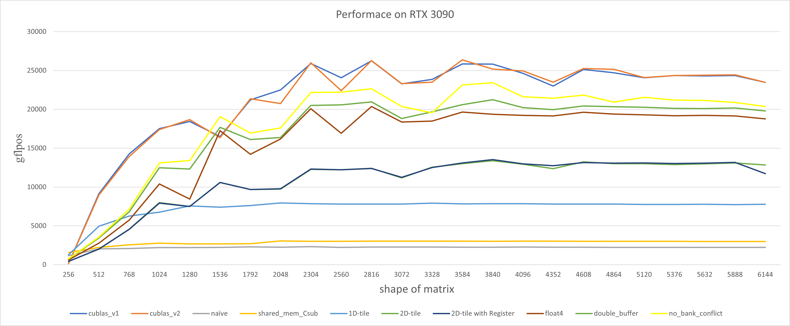
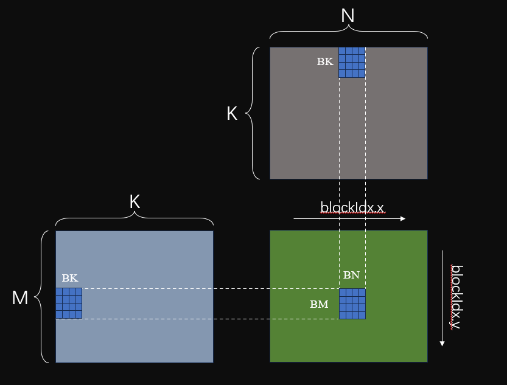
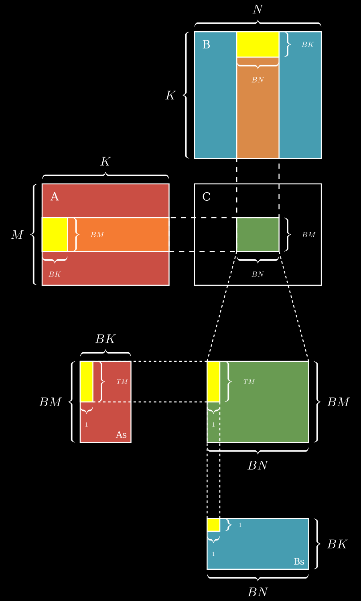
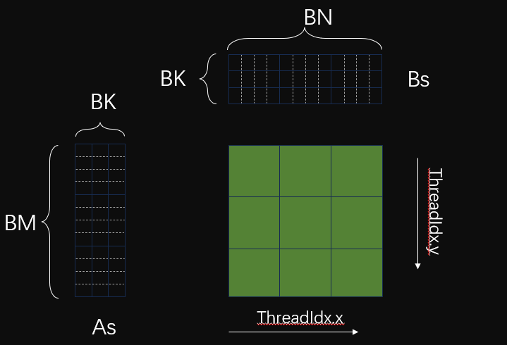
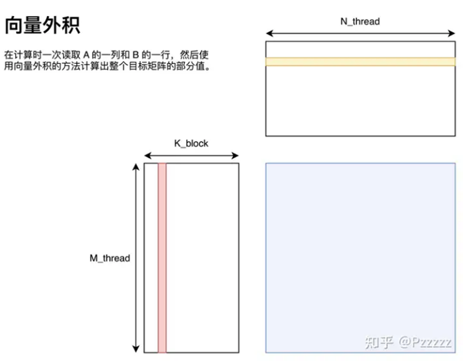
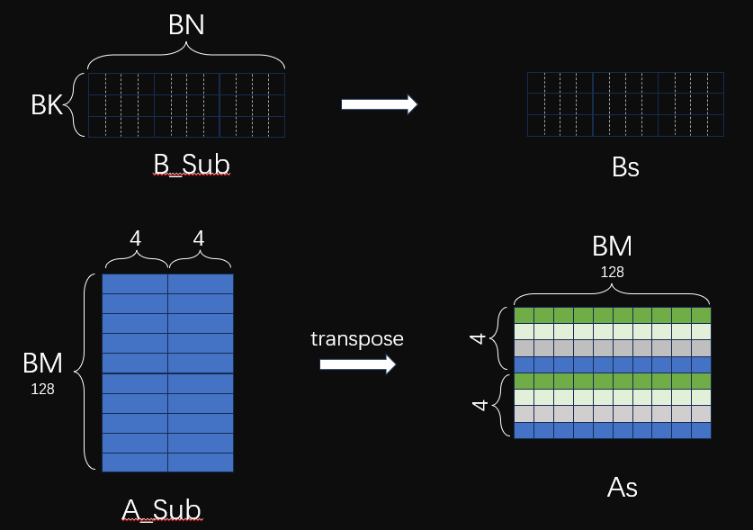
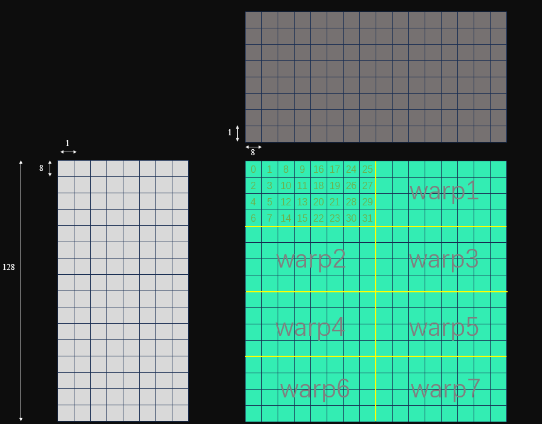
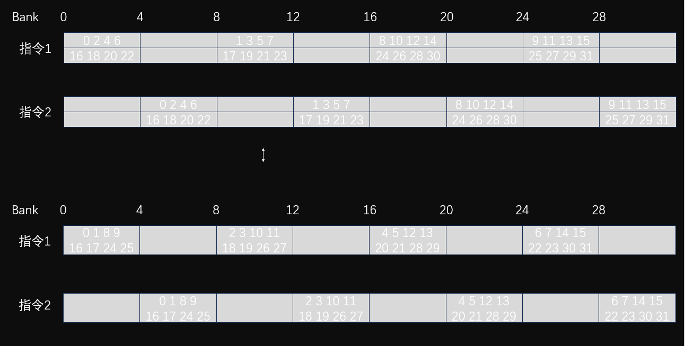
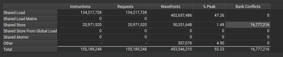
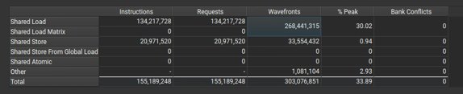

# SGEMM Optimization
这是我的SGEMM性能优化之路，其中包括的文件有：
* `gemm_2.cu`：naive gemm
* `gemm_3.cu`：using shared memory
* `gemm_4_X.cu`：tile, include 1D-tile 2D-tile and 2D-tile-with-register 
* `gemm_5.cu`：using float4
* `gemm_6_double_buffer`: using double buffer
* `gemm7_no_bank_conflict`: avoid bank conflict
* `z_lishaoxia_gemm.cu`: using [z order](https://zhuanlan.zhihu.com/p/441146275) to avoid bank conflict

## 性能对比


## 技术细节

### naive gemm
这是最简单的gemm测试，不考虑使用shared memory

每个线程负责计算C中的一个元素，所以每个线程计算元素需要for循环K个元素，从全局内存中读取2*K次，并写入全局内存1次

**一个发现**：在计算C矩阵的时候，C(x,y)维度和由线程对应的index(x,y)的对应关系对性能有很大影响。当C(x,y)和index(x,y)是x对应y时候，性能较好，反之性能很差。

### using shared memory
当然，这个时候就会想要用到shared memory，因为计算C中的一个元素，从全局内存中读取2*K次，这太傻了...从全局内存读取大概需要200-300cycle，这限制了核函数的计算效率，大量的时间花费在了等待数据的访问上，因此可以使用shared memory来缓存数据。

shared memory是block块内线程共享的，对于一个block中需要计算的BM * BN元素，**有许多重复的地址访问**。因此我们可以使用共享内存缓存一个block中所需要的元素，缓存完毕之后，计算时直接从共享内存中读取数据，节约等待访存时间。**还是一个线程计算一个C中的元素**，如下图所示：



对于BK，我们当然希望BK=K，那么一次性就能全部缓存一个block计算所需要的A和B中的数据，但是当矩阵过大时候，shared memory资源限制不允许我们一次性缓存K长度的数据，因此我们将K长度的数据进一步地划分为BK大小，每次都是缓存BK大小的数据。所以计算流程为：**缓存BK大小的数据-->计算-->缓存下一步的BK大小的数据-->计算--> .... --> 直至K大小的数据计算完毕**。


### 1D-tile

上一个版本中，将global memory中的数据加载到shared memory中，让访存的代价从几百个cycle降低到几十个cycle。但是这并不改变本质问题，一次乘累加只需要几个cycle。**问题的关键在于核心代码的循环计算部分，计算访存比过低，最终导致访存延迟不能被隐藏，从而性能不理想**。

我们无论是使用全局内存还是共享内存，主要的瓶颈都在访存上。为了进一步掩盖访存开销，我们要么可以提高访存的效率，要么让每个线程的负载更多一点，以使得能够掩盖访存的开销。

这里我们先尝试提高每个线程的负载， 让每个线程多计算一些元素的输出。**1d-tile的意思是选择BM或者BN其中一个维度，让每个thread计算这个维度TM大小的数据**。



由于一个block中的thread需要计算TM个数据，因此每个线程在从Global Memory中缓存数据到Shared Memory中的时候，也是需要缓存TM个数据的。

### 2D-tile
进一步地，我们也可以在BN的维度进行tile，这样的话，**每个thread就计算[TM, TN]大小的数据**，如下图所示：



值得注意地是，按照 M-N-K 的循环嵌套顺序实际上是矩阵乘法的向量内积表示形式，A_tile 读取的位置与 i, p 有关，B_tile 读取的位置与 j, p 有关，循环嵌套之下产生了重复的 smem 读取。**在计算Sub_C中的每一块的时候，每次都是使用向量外积的方式计算。使用向量外积的方案可以利用到循环遍历的局部性，将一些重复访存使用寄存器缓存而避免无意义访存**。



### 2D-tile register
2D-tile中，我们使用了向量外积，K循环在外面，TM和TN循环在内部，代码如下：
```
for (int k = 0; k < BK; ++k) {  // 向量外积
    for (int m = 0; m < TM; ++m) {
        int A_row = threadIdx.y * TM + m;
        for (int n = 0; n < TN; ++n) {
            int B_col = threadIdx.x * TN + n;
            val[m][n] += As[A_row][k] * Bs[k][B_col];
        }
    }
}
```

我们可以发现，在TM维度的循环中，其实之后计算所需要的As数据就已经确定了，也就是说无论下面的TN维度的循环，As中的数据都是一样的，那么我们就可以在TM中的循环中缓存这一部分的数据。

对于Bs中的内容，其也只取决于BK维度的循环和TN循环本身，对于TM维度，无论怎么变化，访问的也都是一样的，因此也可以进行缓存！

### float4
通过ncu的分析结果，可以看到当前很多的时间还是花在了访存等待上，可以看到内存带宽的使用负载大于计算负载。

因此除了上述提高计算强度，我们还可以通过`float4`提高访存的效率。相比于访存 4 次获取 4 个浮点数，通过 float4 向量内存指令所需的访存指令数更少，减少了对内存访问的竞争；另一方面，使用向量加载每个字节需要的索引计算更少，我们只需要计算一次索引即可读取 4 个浮点数



**为什么需要transpose As**？因为后续的计算过程中读取As中的大小为TM的一列，如果不Transpose，那么无法通过`float4`读取。

**Transpose之后就不能实现float4 store了，就像上图一样，按照As中的float一个个store**。只不过store的时候一个thread 负责 4大小的一列，tid为0的thread负责As中的第一列，tid为1的thread负责tid为0的下面一列。**由于warp内天然同步，所以图中用四个颜色标识出来了(应该是一个warp内标识的，图中As全部标识了，是错误的)**

需要注意，因为使用了 FLOAT4 访存的缘故，矩阵的元素数量必须是 4 的倍数，不再能够支持任意大小的矩阵（实际上，还是可以支持的，但是边界条件需要更加细致的判断，对性能有所影响）

### double buffer
之前，我们只有一个As，那么在每次迭代(As Bs移动)的过程中，为了保证当前的线程已经完成了当前As和Bs的计算（从而才能第二次迭代的As和Bs的写数据）
我们使用了第二个__sync，保证 Write-After-Read

它本质上是因为我们在不同迭代中使用了同一块空间来保存我们所需的数据，这两次迭代中的数据之间并不存在真正的依赖关系

如果我们将其写入到其他地址上，那么就不需要使用同步了。**于是就可以利用并行化，将两次迭代的计算过程并行化，从而提高性能**。

因此，我们开辟了两倍的As和Bs的空间，如果当前使用的是As1和Bs1，那么下次迭代就使用As2 Bs2，从而使得两次迭代之间不存在依赖关系，从而避免第二次同步操作。


### 消除 bank conflict

#### store时bank conflict分析
##### As中
`float4`中的store shared memory 的 情况如下图所示：


可以看到在Store As的时候，线程奇数和偶数的线程会产生bank conflict，**本质上这是由于BK=8，BM=128（32的倍数），所以相邻的两个线程写入的是同一个bank**。

**解决办法**：将BM + 4，作为新的BM，这样的话相邻的两个线程写入的bank 偏移就是4 * 4(* 4 是因为图中颜色一样的差了4行)。同一个warp内访问的bank index 就是：0-16-1-17-...-15-31，从而解决了bank conflict的问题。

##### Bs
warp中32*4=128，所以一个warp内的线程刚好负责一个B_Sub中的一行。由于使用的是`LDS.128`指令，一个quarter warp=8内，8*4=32刚好访问的是所有bank 所以 **Bs中store是没有bank conflict，只不过是4次wavefont**。

#### load时z-order分析
z-order中的线程排布如下图所示：



As和Bs中的bank情况如下图：



图中的上半部分是Bs中的情况，下半部分是As中的情况，由于一个thread负责的是8*8大小，所以即使是`float4`指令，Bs和As也需要两个指令才能加载完当前thread计算所需要的As和Bs数据。可以看到，**在half warp内，Bs中是间隔为2访问地址一致，As中是间隔为1访问的地址一致，所以都可以合并，并且没有bank conflict！！**

### 代码实现
`gemm7_no_bankConf.cu`思路来源于`大变化`中的策略（我没看懂，为什么这样就可以避免bank conflict，**它只能消除store时候的bank conflict**,`ncu`结果如下图：


 
`gemm_7_no_BC_z_order.cu`李少侠大佬的z order避免bank conflict：**查看bank conflict目录下中的README中的资源链接2**，这个可以**完全消除load 和 store时候的bank conflict**，`ncu`结果如下图：




## Resource
> https://zhuanlan.zhihu.com/p/441146275 李少侠

> https://linn-ylz.com/Computer-Science/CUDA/CUDA-SGEMM-optimization-notes/#fn2 大变化 代码主要参考文章

> https://zhuanlan.zhihu.com/p/584236348 Hands-on-GEMM 不完全指北 分析的很详细 比李少侠的浅显一点

> https://chiemon.github.io/2023/07/20/Paper-List.html 部署相关 杂七杂八不错的资源