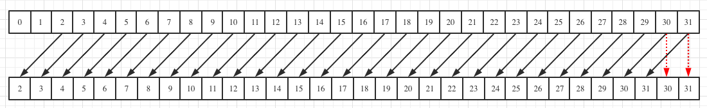
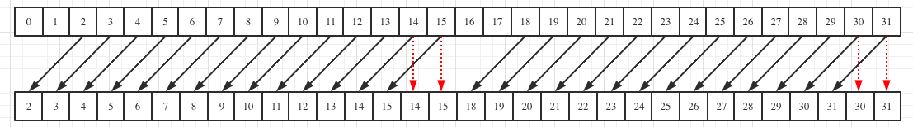

# Reduction

## 思路
1. 利用`float4`操作，从global memory向量化读取数据到寄存器，并顺便将4个float相加，**同步**

2. 在warp内，利用`__shfl_down_sync`实现warp内的reduce

3. 将一个block内的warp reduce的结果写入shared memory数组`[warp_num]`，**同步**

4. tid小于`warp_num`的线程，读取shared memory中的数据，并再次使用`__shfl_down_sync`完成该warp中的reduce

5. tid=0的线程写回该block的reduce数据

## __shfl_down_sync
```
T __shfl_down_sync(unsigned mask, T var, unsigned int delta, int width=warpSize);
```
* `mask` 表示哪些线程参与这次计算，`0xffffffff`进制描述了32个线程的参与情况，因为f都是1，所以所有线程均参与
* `T var` 表示传递的变量
* `delta` 表示stride
* `width` 表示当前操作对应的是多少线程

`__shfl_down_sync(0xffffffff, x, 2)`:



`__shfl_down_sync(0xffffffff, x, 2, 16)`:



## resource
> https://zhuanlan.zhihu.com/p/572820783

> https://gitee.com/magicor/AIDeploy/blob/master/cuda/reduce/reduce_shuffle.cu

> https://zhuanlan.zhihu.com/p/690756572