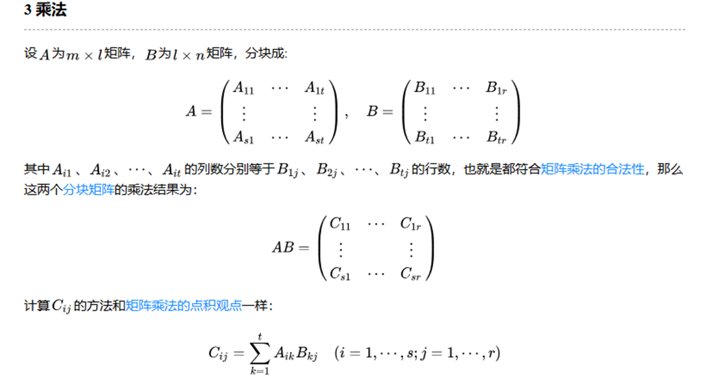
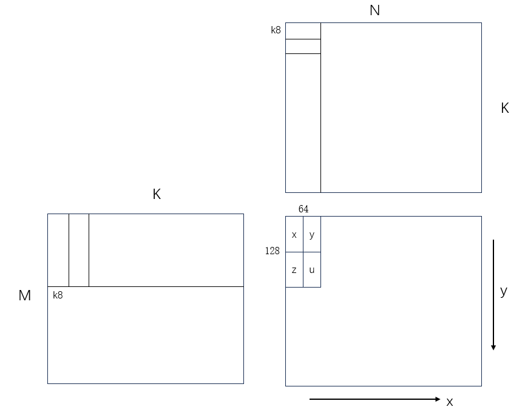
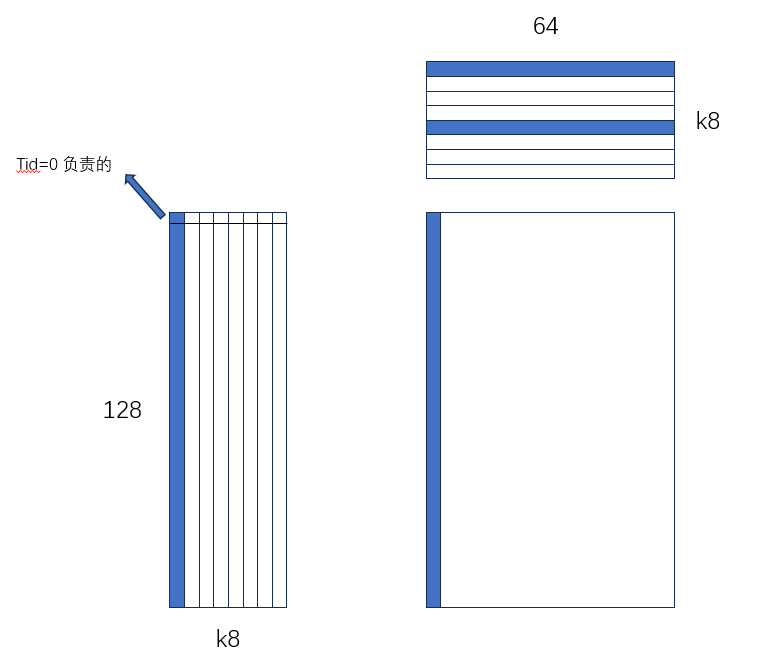
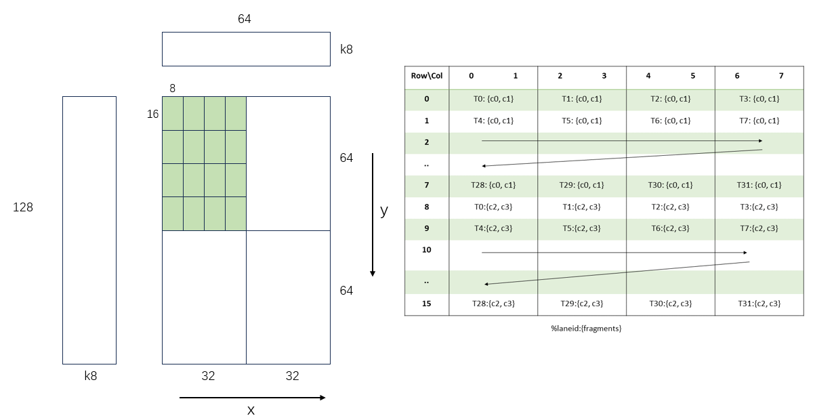
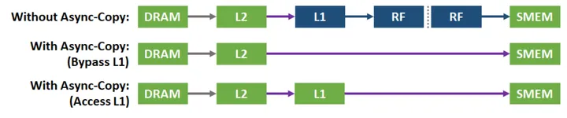
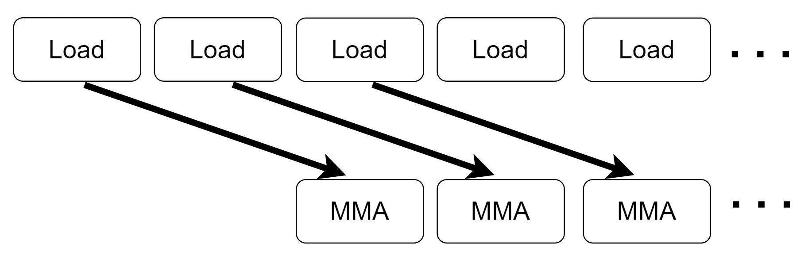
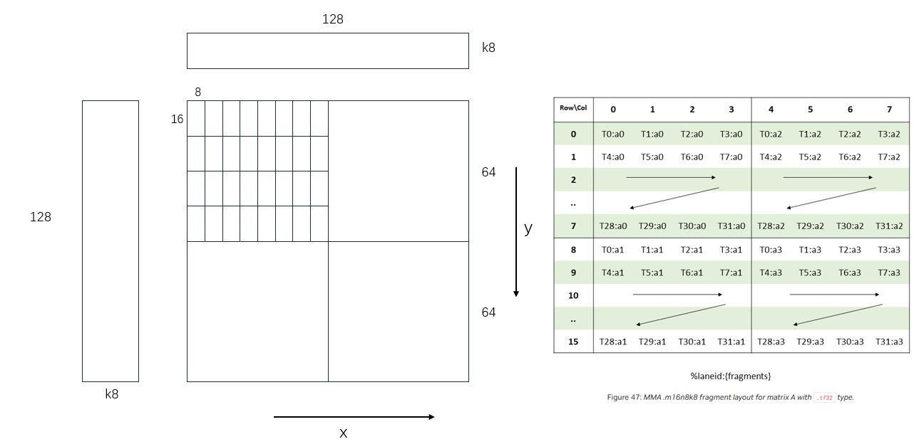

# Warp Matrix Operations

This is the usage of the warp matrix operations with the warp matrix operations in C++. See [wmma](https://docs.nvidia.com/cuda/cuda-c-programming-guide/index.html#warp-matrix-functions).

> C++ warp matrix operations leverage Tensor Cores to accelerate matrix problems of the form D=A*B+C. These operations are supported on mixed-precision floating point data for devices of compute capability 7.0 or higher. This requires co-operation from all threads in a warp. In addition, these operations are allowed in conditional code only if the condition evaluates identically across the entire warp, otherwise the code execution is likely to hang.

在cuda中，有两种方式使用tensor core，一种是使用`wmma`接口，另一种是使用`mma`指令。前者是在cuda C中使用的，后者是在PTX中使用的。

两者之间的关系：


## wwma 接口
对应的代码在`wmma.cu`中。

与FP32 Core类似，Tensor Core就是一个运算单元，前者输入两个浮点数，返回一个浮点数加法结果，后者输入两个矩阵，返回矩阵乘法结果。在cuda C的tensor core接口（wmma）中，kernel核函数中一次tensor core的运算需要占用一个warp的线程（32个）。由于tensor core的一次运算的矩阵大小是固定的，所需线程数也是固定的，所以我们多个tensor core并行运算需要对矩阵、线程进行分割。

假设A[M, K], B[K, N]，其中M是A的行数，K是A的列数，N是B的列数，tensor core的一次矩阵运算的形状为[m, k] * [k, n] = [m, n]，其中从A矩阵中分割出[m, k]的子矩阵，从B矩阵分割出[k, n]的子矩阵，得到一个[m, n]的子矩阵。通过简单的计算可得，A矩阵要求在y方向上需要M / m个warp的线程（每个warp负责[m, k]的矩阵），B矩阵要求在x方向上需要N / n个warp的线程，而在kernel内进行K / k次的循环累加即可得到C中[m, n]的子矩阵。

in the `wmma.cu` file, I use the thrust library to create the host and device matrix. For more infomation, see [thrust](https://docs.nvidia.com/cuda/thrust/index.html) and [thrust pdf](https://docs.nvidia.com/cuda/pdf/Thrust_Quick_Start_Guide.pdf).

## mma 接口
本文使用了`mma`指令，**优化Tensor Core上的GEMM**。

主要的尝试以及对应的源代码文件：
1. `1_vec.cu`：使用`float4`指令来优化数据传输
2. `2_bankC_co.cu`：消除bank conflict以及合并global memory的访问
3. `3_async.cu`：使用Ampere的异步输出传输优化
4. `4_reg.cu`：对C矩阵使用寄存器优化
5. `5_prefetch.cu`和`6_prefetch_opti.cu`：使用双缓冲优化
6. `7_reshape.cu`：增加计算强度
7. `8_swizzle.cu`：使用CUTLASS中的swizzle技术优化
8. `9_ldmatrix.cu`：使用`ldmatrix`指令优化

### 分块矩阵乘法的原理


### baseline
#### BLOCK and GRID
BLOCK_DIM：128 包含4个warp(x,y,z,u)。每个warp负责计算大小为64*32大小的矩阵。由于`m16n8k8`，所以每个warp计算16个`mma`操作。

A B矩阵沿着K方向每次将`k=8`长度的矩阵送入shared memory，直至`K`方向上所有计算完成，即完成C矩阵中的128*64的矩阵的计算。运算正确性由上一节的分块矩阵乘法的原理保证。



#### load from A and B C
**A矩阵是row-major的**，将A矩阵送入shared memory中时，由于一个block只有128threads，所以每个线程需要搬运k个数据。在此，通过`threadIdx.x * 8`将每个线程的起始index对应于下图A矩阵最左侧的蓝色区域，同时，通过大小为K的循环，每个线程负责搬运的数据为一行。源码中，`tile`代表着一个线程负责搬运的数据点。
```
 for (int i = 0; i < K; i++)
{
    int tileIdx = threadIdx.x * 8 + i;
    int rowA = tileIdx / K + blockIdx.y * 128;
    int colA = i + idx * K;

    A[tileIdx] = rowA < arg.problem_size.m() && colA < arg.problem_size.k() ? arg.A[rowA * arg.problem_size.k() + colA] : ElementInputA(0);
}
```

**B矩阵是column-major的**，将B矩阵送入shared memory中时，同样由于一个block只有128threads，所以每个线程需要搬运4个数据，由于是column-major的，同时global memory最好是连续的内存读写，因此每个线程负责的4个数据与A中一行连续的4个数据不同，应该是列连续的。通过`threadIdx.y * 4`将每个线程的起始index对应于下图B矩阵的蓝色区域，同时，通过大小为4的循环，每个线程负责搬运的数据蓝色区域及其同列的4个数据点。源码中，`tile`代表着一个线程负责搬运的数据点。
```
__device__ void loadtileB(MMAarguments &arg, ElementInputB *B, int idx)
{
    // iter = 64 * 8 / 128
    for (int i = 0; i < 4; i++)
    {
        int tileIdx = threadIdx.x * 4 + i;
        int rowB = idx * K + tileIdx % K;
        int colB = blockIdx.x * 64 + tileIdx / K;

        B[tileIdx] = rowB < arg.problem_size.k() && colB < arg.problem_size.n() ? arg.B[colB * arg.problem_size.k() + rowB] : ElementInputB(0);
}
```

**C矩阵是row-major的**，首先将128个线程`threadIdx.x * 64`，以此将其分配到C中的蓝色区域，每个线程负责搬运一行数据，因此循环的大小位64。
```
__device__ void loadtileC(MMAarguments &arg, ElementOutput *C)
{
    // iter = 128 * 64 / 128
    for (int i = 0; i < 64; i++)
    {
        int tileIdx = threadIdx.x * 64 + i;
        int rowC = tileIdx / 64 + blockIdx.y * 128;
        int colC = tileIdx % 64 + blockIdx.x * 64;

        C[tileIdx] = rowC < arg.problem_size.m() && colC < arg.problem_size.n() ? arg.C[rowC * arg.problem_size.n() + colC] : ElementOutput(0);
    }
}
```


#### mma计算



BLOCK内是有4个warp的，每个warp负责计算的结果是64*32大小的矩阵，也就是说**一个warp需要计算16次大小为m16n8k8的mma操作**。有颜色的小矩阵代表一次mma操作。

使用的PTX指令为`mma.sync.aligned.m16n8k8.row.col.f32.tf32.tf32.f32`，根据Resource 1可以得到每次`mma`指令每个线程分配到的fragment，所以**每个线程负责获取到该次`mma`操作该线程负责的数据**。我们以其中一次`mma`操作中的C矩阵的index计算为例：
```
for (int tileidx = 0; tileidx < 16; tileidx++)
{
    // 4 * 4 mma operations in one warp, so the row and column index from 0 to 3
    int rowtile = tileidx / 4;
    int coltile = tileidx % 4;
    cd[0] = (rowwarp * 64 + rowtile * M + laneidx / 4) * 64 + colwarp * 32 + coltile * N + laneidx % 4 * 2;
    cd[1] = cd[0] + 1;
    cd[2] = cd[0] + 8 * 64;
    cd[3] = cd[2] + 1;

    ......
}
```

`laneidx / 4`是计算在上图中的第几行，`laneidx % 4`是计算在上图中的第几列(一共4列，每列是两个元素的)。这里的`tile`指的是哪个小绿色矩阵。
> 在PTX中，有公式计算index的

```
asm volatile(
    "mma.sync.aligned.m16n8k8.row.col.f32.tf32.tf32.f32 "
    "{%0,%1,%2,%3}, {%4,%5,%6,%7}, {%8,%9}, {%10,%11,%12,%13};\n"
    : "=f"(C[cd[0]]),                                     // D[0]   32bit
        "=f"(C[cd[1]]),                                     // D[1]
        "=f"(C[cd[2]]),                                     // D[2]
        "=f"(C[cd[3]])                                      // D[3]
    : "r"(*reinterpret_cast<uint32_t const *>(&A[a[0]])), // A[0]   32bit
        "r"(*reinterpret_cast<uint32_t const *>(&A[a[1]])), // A[1]
        "r"(*reinterpret_cast<uint32_t const *>(&A[a[2]])), // A[2]
        "r"(*reinterpret_cast<uint32_t const *>(&A[a[3]])), // A[3]
        "r"(*reinterpret_cast<uint32_t const *>(&B[b[0]])), // B[0]
        "r"(*reinterpret_cast<uint32_t const *>(&B[b[1]])), // B[1]
        "f"(C[cd[0]]),                                      // C[0]
        "f"(C[cd[1]]),                                      // C[1]
        "f"(C[cd[2]]),                                      // C[2]
        "f"(C[cd[3]])                                       // C[3]
);
```
1. 为什么要使用`=f`？

    an asm output operand must have one of the '=' or '+' modifiers
2. 类型转换？

    `*reinterpret_cast<uint32_t const *>(&A[a[0]])` is standard c++. “treat the element A[a[0]] as uint32_t, and load it” 取地址是因为`reinterpret_cast`要求是指针类型。
3. `"r" "f"`是什么意思？

    可以参考Resource 2 inline PTX in cuda。
    ```
    “h” = .u16 reg
    “r” = .u32 reg
    “l” = .u64 reg
    “f” = .f32 reg
    “d” = .f64 reg
    ```
4. 为什么`TF32`类型需要使用`.u32 reg`？
    在[PTX Data Type](https://docs.nvidia.com/cuda/parallel-thread-execution/index.html#alternate-floating-point-data-formats)中：A register variable containing tf32 data must be declared with .b32 type.

5. 为什么要使用类型转换？

    不使用的话，会出现`error: more than one conversion function from "ElementInputB" to a built-in type applies:`错误，在CUTLASS中，有不同的`TF32`到内置类型的转换。

### vectorize

数据搬运是一样的，只不过一次搬运4个数据了。

### no bank conflict and merge global memory access
bank conflict的优化方法应该在性能调优的靠后的位置上进行，而不是刚开始就进行这方面的调优。

### async

#### 异步数据传输简介

CUDA 11 引入了一个新的async copy(异步拷贝)API来利用 A100 GPU 硬件加速将数据从global memory(全局内存) 直接拷贝到shared memory(共享内存)。异步拷贝会执行从全局内存到共享内存的异步(非阻塞)直接内存传输(旁路SM，也就是不经过寄存器)，它将"从全局内存加载数据到寄存器"和"将数据从寄存器写入共享内存"这两个操作结合成单个且高效的操作。

异步拷贝消除了通过寄存器存储中间数据的需要，进而减少了所需的寄存器访问带宽。它有效地利用了存储带宽并且降低了功耗。正如它的名字所表明，异步拷贝是异步完成的，允许其他的计算和从全局内存到共享内存的数据搬运同时发生。异步拷贝通过新的同步特性来通知程序数据搬运的完成。

异步拷贝指令有两个变种，适用于不同的使用场景。BYPASS：旁路掉L1缓存和寄存器，ACCESS：将数据保存到L1以供后续访问和重用。

#### 实现
```
cp.async.ca.shared.global [dst], [src], cp-size;
```
代码中，`cp-size`为16，AB中，虽然是TF32，但是sizeof还是4字节的，C中的`f32`自然是4字节，搬运的自己字节数一次还是16。也就是一次拷贝的数据是4个，即和`float4`是一样的。

### register
在之前的计算中，从A B C中加载数据时，都是使用的shared memory：
```
// previous
__shared__ ElementInputA tileA[128 * 8];
__shared__ ElementInputB tileB[8 * 64];
__shared__ ElementOutput tileC[128 * 64];

// use registers
__shared__ ElementInputA tileA[128 * 8];
__shared__ ElementInputB tileB[8 * 64];
ElementOutput C_fragment[64];
```
由于block中的计算，每个warp中的计算都需要不同的A B中的数据，因此A B中的数据存储在shared memory中是合理的，但是对于C来说，每个线程需要用到的C是一样的，线程之间不会发生访问对方负责的C，所以**C是应该使用寄存器存储的**！

每次`mma`操作，每个线程负责的是4个输出数据，在每个warp中，一共有4*4次`mma`操作，所以每个线程最终需要的是4*4*4=64个数据，也就是说，每个线程需要64个寄存器来负责C的数据。

由于C中的数据使用线程私有的寄存器存储，那么在整体的计算过程中，C从global memory到寄存器的数据搬运就不能按照之前的方式了，需要考虑到后面的`mma`operation每个线程所需要的数据；同样写回到全局内存时候，也需要考虑到这一情况。

#### load from C
如`mma`计算中图所示，我们需要根据`mma`指令中C的数据fragment的分布。由于C每个线程负责的4个数据，只有两两是连续的，因此使用的是`float2`向量化读取数据。和之前`mma_tile`函数类似，这里C的数据搬运也是需要计算`warpidx` `rowwarp` `colwarp` `laneidx`等参数的，根据这些参数来计算每个线程需要搬运的数据的index。
```
const int warpidx = threadIdx.x / 32;
const int laneidx = threadIdx.x % 32;
const int rowwarp = warpidx / 2;
const int colwarp = warpidx % 2;

for (int i = 0; i < 16; i++)
{
    int rowtile = i / 4;
    int coltile = i % 4;
    for (int j = 0; j < 2; j++)
    {
        int rowC = blockIdx.y * 128 + rowwarp * 64 + rowtile * 16 + laneidx / 4 + j * 8;
        int colC = blockIdx.x * 64 + colwarp * 32 + coltile * 8 + laneidx % 4 * 2;

        bool test0 = test(rowC, colC, arg.problem_size.m(), arg.problem_size.n());
        bool test1 = test(rowC, colC + 1, arg.problem_size.m(), arg.problem_size.n());

        if (test0 && test1)
        {
            *reinterpret_cast<float2 *>(&C_fragemnt[i * 4 + j * 2]) = *reinterpret_cast<float2 *>(&arg.C[rowC * arg.problem_size.n() + colC]);
        }
        else
        {
            C_fragemnt[i * 4 + j * 2] = test0 ? arg.C[rowC * arg.problem_size.n() + colC] : ElementOutput(0);
            C_fragemnt[i * 4 + j * 2 + 1] = test1 ? arg.C[rowC * arg.problem_size.n() + colC + 1] : ElementOutput(0);
        }
    }
}
```
同样，`laneidx/4`是计算在`m16n8k8`第几行，`laneidx%4`是计算在上图中的第几列。`C_fragemnt`中存储数据的顺序是`tileidx`的：`C_fragemnt`的0-3的数据存储的是最左上角`mma`计算需要的C的数据，这四个数据内部的顺序和表格中一致；`C_fragemnt`的4-7的数据存储的是第一行第二个绿色矩阵所需要的C的数据；依次类推。

#### mma
`mma`计算基本上和之前的一样，只不过C矩阵的下标计算不需要那么复杂了，由于每个线程负责的数据都在自己的寄存器上，因此根据当前计算的`tileidx`就可以得到了。
```
: "=f"(C_fragment[tileidx * 4 + 0]),
"=f"(C_fragment[tileidx * 4 + 1]),
"=f"(C_fragment[tileidx * 4 + 2]),                
"=f"(C_fragment[tileidx * 4 + 3])
```

#### store C
和从C中读取数据类似，根据当前线程的`warpidx` ``rowwarp` `colwarp` `laneidx`等参数，计算出每个线程内的寄存器需要写回的数据的index。

### prefetch
假设计算`mma_{i}`依赖于数据`data_{i}`, `load data_{i}`代表开始加载数据`data_{i}`, 只有在`synchronize`后加载的数据才保证可见, 那么数据预取的伪代码如下:
```
const int iters = (arg.problem_size.k() + K - 1) / K;

    loadtileC(arg, C_fragment);

    loadtileA(arg, tileA[0], 0);
    loadtileB(arg, tileB[0], 0);

    for (int i = 0; i < iters; i++)
    {
        if (i + 1 < iters)
        {
            asm("cp.async.wait_all;\n" ::);
            __syncthreads();
            mma_tile(arg, tileA[i % 2], tileB[i % 2], C_fragment);
            loadtileA(arg, tileA[1 - i % 2], i + 1);
            loadtileB(arg, tileB[1 - i % 2], i + 1);
        }
        else
        {
            asm("cp.async.wait_all;\n" ::);
            __syncthreads();
            mma_tile(arg, tileA[i % 2], tileB[i % 2], C_fragment);
        }
    }

    storetile(arg, C_fragment);
```
这样可以让数据加载`(data_{i+1})`和计算`(mma_{i})`尽可能重叠起来。

### prefetch optimize
这里将预取的数据增大了一倍，并且显式地调用同步指令`cp.async.waitgroup N`来确保数据已经拷贝完成，主要流程如下图片:


但是实测下来，发现这种方式并没有提升性能，反而降低了性能。猜测：**可能是因为数据预取的数据量过大，导致超出了硬件所允许的shared memory的使用限制（可能是thread级别的限制 也可能是block级别的限制）**。

### reshape and register A B
调整后每个warp计算由32x64变为64x64。同样的block中还是4个warp，所以最终block计算的大小由64x128变为128x128。



对于上图一个warp负责的那1/4的矩阵来说，每一的小矩阵的计算所需要的A矩阵是一样的，也就是说这一行的计算每个线程在A矩阵上对应的fragment是一样的(右边的图上的对应规则)。所以，在整个1/4矩阵的计算过程中，每个线程负责的A矩阵的Fragment所包含的数据只有4*4(因为4行)=16。

### threadblock swizzle
如果我们不做block swizzle，用代数表达每个threadblock的tile是(tbm, tbn)，那么我们可以看出线程块是先按照axis n发射$(n+(tbn-1)/tbn)$个，然后再遍历 axis m，如果n非常大，那么我们相当于先做了一个长方形的矩阵乘法，那么每一个发射的block读取的右矩阵的global位置都是不同的，访存量用公式表示为:
$$
mem = left_mem * l_num + right_mem * r_num;  
$$
$$
left_mem = tbm * k;  
$$
$$
right_mem = k * tbn;  
$$ 

* 如果不swizzle，lnums = 1， rnums = n。
* 如果apply了block swizzle我们就相当于在给定N的步长内，我们会换到下一行去计算，我们可以得到lnums = N, rnums = n/N。

显而易见，当我们swizzle了之后，在计算量相同的情况下，单个tile的访存量变小了(对整个gemm来说总量并不变)，且在load过程中减少了cache miss


## resources
1. [mma in PTX](https://docs.nvidia.com/cuda/parallel-thread-execution/index.html#matrix-multiply-accumulate-operation-using-mma-instruction)
2. [Inline PTX Assembly in CUDA](https://docs.nvidia.com/cuda/inline-ptx-assembly/index.html)
3. [一步步优化tensor core上的GEMM(主要参考文章)](https://zhuanlan.zhihu.com/p/638522893)
4. [深入分析CUTLASS系列](https://zhuanlan.zhihu.com/p/679929705)
5. [CUTLASS 3.x 异构编程随感](https://zhuanlan.zhihu.com/p/689829403?utm_psn=1757913209187926016)
6. [cute 之 Swizzle](https://zhuanlan.zhihu.com/p/671419093)