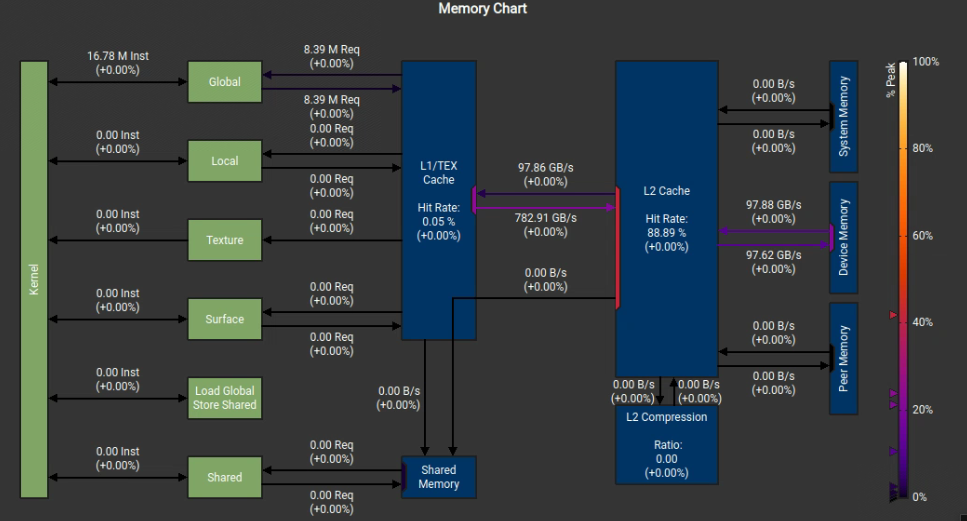
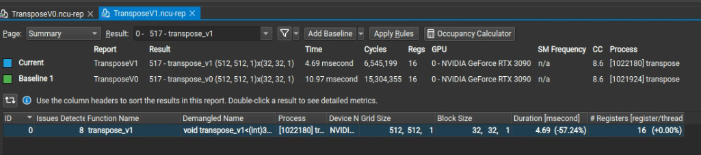

# Matrix Transpose

## 问题描述
给定一个以行优先方式存储的 $M \times N$，需要得到一个同样是以行优先存储的 $N \times M$ 的同样是以行优先存储的矩阵 

## 测试环境
所有实验均选取 $M = N = 16384$ 作为输入矩阵大小，并采用 3 轮热身，评测 100 轮取平均值和标准差的方式得到运行时间。

## 方法

### naive
该方法启动内核函数，每个线程负责一个元素的转置。

`blockDim`在输入矩阵的行列两个维度上，所以`gridDim`是输入矩阵的行列维度除以`blockDim`的两个维度

```cpp
template <int BLOCK_DIM_X, int BLOCK_DIM_Y>
__global__ void transpose_v1(int M, int N,
                             const float *__restrict__ iA,
                             float *__restrict__ oA) {
    const int x = blockIdx.x * BLOCK_DIM_X + threadIdx.x;
    const int y = blockIdx.y * BLOCK_DIM_Y + threadIdx.y;
  
    if (x >= N || y >= M) {
        return;
    }

    oA[x * M + y] = iA[y * N + x];
}
```
下图为内存使用情况：



### 避免Global Memory的非合并访问
Naive方法中，对于Global Memory的写是不连续的，所以会造成内存访问难以合并，并且也很难被缓存。即使改变使得Global Memory的写为连续，那么必然会造成`iA`的读为不连续。

在此，我们使用Shared Memory来缓存。

下图中`baseline`即为naive方法，可以看到执行时间上有较大提升。



下图为内存使用情况，可以看到device memory有 $130\%$左右的提升


下图为Shared Memory中的bank conflict情况：


可以看到冲突十分严重，下面着手改善

### 避免Shared Memory的bank conflict

